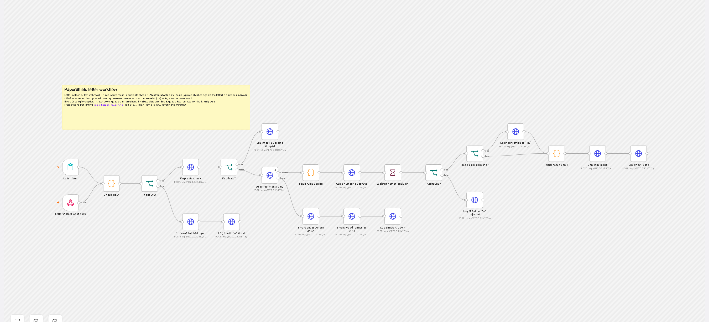
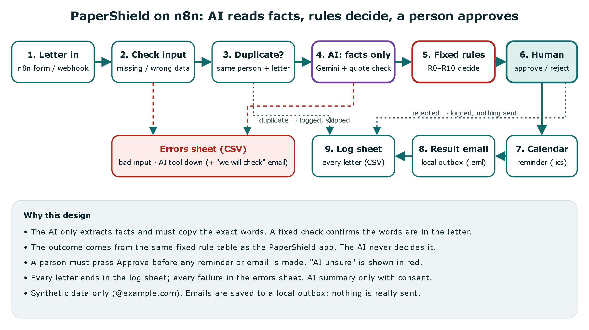

# PaperShield letter workflow on n8n

**AI reads the facts. Fixed rules decide. A person approves.**
The [PaperShield app](https://mai-hakim.github.io/papershield/) works on the phone without AI. This project is its companion: the same decision rules running as an **n8n workflow**, with an AI step that only *extracts facts* and a human who must approve before anything is sent.
All data is **synthetic**: made-up letters and `@example.com` addresses.

**Demo video:** [docs/demo/papershield-n8n-demo.mp4](docs/demo/papershield-n8n-demo.mp4) (40 s, MP4). Recorded with Playwright, then converted to H.264 MP4 at 1.5× speed with ffmpeg so it plays on iPhone, Android and every desktop browser. A scam letter is caught, the reviewer rejects it, an "AI unsure" letter is flagged in red, and the errors sheet shows a failed AI call.



## The problem
An AI that reads letters can make things up, and a wrong answer about a bill or a scam can cost an older person money. A useful automation still needs reminders, records and a clear email.

## The solution
| Step | n8n node(s) | Who decides |
|---|---|---|
| 1. Letter in | **Form Trigger** (a real form page) or **Webhook** (used by the tests) | — |
| 2. Check input | Code: missing text, too short, not an email, not a synthetic address | fixed rules |
| 3. Duplicate check | same person + same letter already sent → logged and skipped | fixed rule |
| 4. AI extracts facts only | Gemini (free tier) returns sender, amount, due date, signature, payment methods, SSN request, links. **Every value must come with the exact quote**; a fixed check confirms the quote is really in the letter, otherwise the field is marked *unsure* | AI reads, rules check |
| 5. Fixed rules decide | Code: the same R0–R10 table as the app (scam signs first) | fixed rules |
| 6. Human approval | an approval page shows the result, the facts, the letter and a red warning if the AI was unsure; the **Wait** node pauses the workflow until a person presses Approve or Reject | a person |
| 7. Calendar reminder | `.ics` file (opens in any calendar), alert 2 days before | — |
| 8. Log sheet + errors sheet | CSV files (open in Excel or Google Sheets) | — |
| 9. Result by email | written to a local outbox (`.eml`). **No real email is sent.** | — |

An **AI summary** of the letter is only written if the sender ticked "Yes" on the form (consent).



## Tools (all free)
n8n 2.42.5 (self-hosted on a laptop with `npx n8n`), Node.js (helper service, no extra packages), Google Gemini free tier (`gemini-3.1-flash-lite`, with `gemini-3.6-flash` and `gemini-3.5-flash` as fallbacks; each free model allows about 500 requests a day), Playwright (demo video and canvas images).

## Error handling
| Problem | What happens |
|---|---|
| Missing data (empty or very short letter) | errors sheet + log sheet `error-bad-input`; nothing decided |
| Wrong data (not an email, not a synthetic address, impossible date or amount from the AI) | errors sheet; impossible AI values are marked *unsure* |
| Duplicate | log sheet `duplicate-skipped`; no second email |
| AI unsure (smudged amount or date, or a quote that is not in the letter) | the outcome still comes from the rules; the reviewer sees a red warning; the email says "please check" |
| AI tool down | the HTTP node's error output → errors sheet + an email "we could not read your letter automatically, a person will look; do not pay anyone who calls you about it" |
| Human rejects | log sheet `rejected-not-sent`; no reminder, no email |

## Test cases and results (real runs on this laptop, October 8, 2026)
`tests/run-tests.js` sends 7 cases to the running workflow and gives the human decision through the same approval page a person uses.

| Case | Expected | Result |
|---|---|---|
| 1 Normal bill | Action needed, approved → reminder + email + log `sent` | ✅ |
| 2 Missing data | errors sheet, no email | ✅ |
| 3 Wrong data (bad email) | errors sheet, no email | ✅ |
| 4 Duplicate | log `duplicate-skipped`, no email | ✅ |
| 5 AI unsure (smudged amount and date) | AI flags both fields; reviewer warned; email says "please check" | ✅ |
| 6 Tool down | errors sheet + "we will check by hand" email | ✅ |
| 7 Human rejects (scam letter) | rules say Scam (R1); reviewer rejects; nothing sent | ✅ |

**History, honestly:**
- First run: 7 of 7 passed. But reading the emails showed a real bug: case 5 said "Respond by null." The tests only checked statuses, so they missed it. I fixed the message ("There is a date on this letter, but it could not be read clearly…"), switched to readable dates, and added a test check that fails if an email contains "null", "undefined" or a raw `2026-10-30` date.
- Second run, right after restarting n8n: 6 of 7. Case 1's email still had the old wording, so the restarted n8n seems to have served the previous workflow version once. I did not fully confirm the cause.
- Third run: **7 of 7**.
- Fourth run (October 8, evening), after switching the AI model to `gemini-3.1-flash-lite`, because the earlier model had used up its free daily limit during Project A: **7 of 7**. With the faster model, each case took 2 to 11 seconds.

A real sample run is in [docs/sample-run/](docs/sample-run/): the log sheet, errors sheet, emails, calendar file and `test-results-latest.json`.

## Run it yourself
```bash
# 1. the helper (AI key goes in .env: GEMINI_API_KEY=...)
node helper/helper.js
# 2. n8n
npx n8n@2.42.5 import:workflow --input=workflow.json
npx n8n@2.42.5 publish:workflow --id=paperShieldFlow1
npx n8n@2.42.5 start
# 3. use the form at http://localhost:5678/form/papershield-letter  — or run the tests:
node tests/run-tests.js
```
Approval pages: http://127.0.0.1:3457/pending · sheets and outbox: http://127.0.0.1:3457/

## Limits (honest)
- Synthetic letters only: 7 test cases, not real mail. The AI's accuracy on real letters has not been measured.
- "Sheets" are CSV files and "email" is a local outbox. A real version would use Google Sheets and Gmail with proper accounts.
- The free Gemini tier has daily limits (about 500 requests per model per day), and it is slower when busy: one run had AI cases taking 21 to 32 seconds, while the last run took 2 to 11 seconds.
- One reviewer, no login on the approval page (it only listens on this laptop, 127.0.0.1).

## What I would do in production
Real Google Sheets, Gmail and Calendar nodes with OAuth; an authenticated approval page with an audit trail; a privacy review before any real letter touches an AI service, plus redaction of account and Social Security numbers before the AI call; a measured accuracy test on a labelled set of redacted letters; monitoring and alerts on the errors sheet.

## My role
I (Mai Hakim) designed this workflow and decided the steps, the rules, the human approval and the test cases. **Claude (an AI assistant) wrote the code.**
Inspired by a capstone idea; this is my own independent build.
